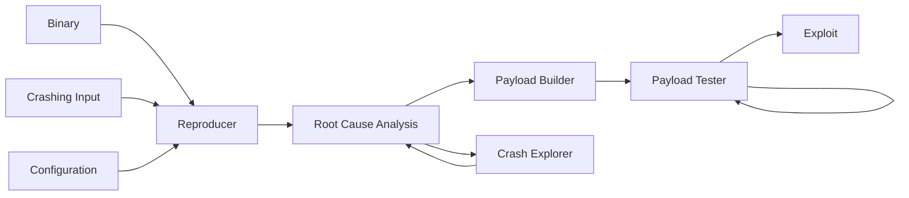

# Autoexploit

## Description
This program, currently under construction, is designed to exploit binaries with buffer overflow vulnerabilities, ultimately providing shell access. It automates the exploitation process by analyzing the crashing behavior of vulnerable binary executable programs. The script systematically attacks these binaries with crafted inputs, observing how the program crashes and extracting valuable information. This data is then used to develop a precise payload that manipulates vulnerable memory, enabling the execution of arbitrary code. By gaining control over the execution flow, the program successfully spawns a shell, demonstrating how vulnerabilities can be exploited for full system access.

## Install and Build

```sh
git clone https://github.com/myrtopar/autoexploit.git .
docker pull myrtopar/autoexploit:latest
docker build -t autoexploit .
```

## Demo Run

```sh
cd /path/to/cloned/repo
docker run --rm --privileged -v `pwd`/src:/app/src -v `pwd`/crash_inputs:/app/crash_inputs -it myrtopar/autoexploit:latest


#autoexploit.py exploits the target binaries and spawns a /bin/sh
python3 src/autoexploit.py {target_bin} {crash_input} {arg_config}
```
**crash_input**: file name of crash input or raw bytes of input <br />
**arg_config**: argument configuration of the vulnerable target binary (e.g {arg1} input {arg3} ... where <u>input</u> is the payload access point) <br />

## System Diagram



**Binary**: Target binary to be exploited.<br />
**Crashing input**: when the target binary is executed with this specific input, it will trigger a segmentation fault.<br />
**Configuration**: Information on how the program should be executed (command line arguments needed).<br />
**Reproducer**: Validates that the input causes a memory corruption crash and reproduces the crash.<br />
**Root Cause Analysis**: Confirms that a payload input was provided, capable of reaching the return address.<br />
**Crash explorer**: Analyzes the metadata of a crash that failed to reach the return address and generates a mutation.<br />


<!-- ## Contribute -->

## LICENSE

MIT license

## Demo

Produced in [asciinema](https://asciinema.org/).

## Add your target binaries
To use the program on your own vulnerable target binaries, you can add them by modifying the provided Dockerfile. Copy your binary in the `/mnt/binaries` directory.
Make sure to disable NX and stack canary. <br />
`gcc -fno-stack-protector -z execstack -Wl, -z, relro, -z, lazy -o target_bin source.c`

<!-- for tests: <br />
docker run --rm --privileged -v `pwd`/src:/app/src -v `pwd`/tests:/app/tests -v `pwd`/crash_inputs:/app/crash_inputs -e PYTHONPATH=/app/src -it myrtopar/autoexploit:latest <br />
python3 -m pytest tests/test_exploit.py::test_exploit <br />


