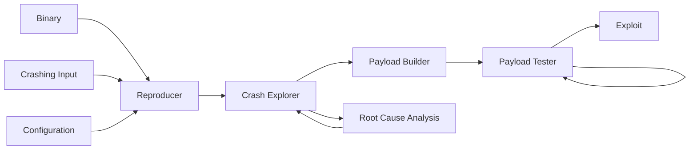

# Pivot

## Description
This system is designed to exploit binaries with buffer overflow vulnerabilities, ultimately providing shell access. It automates the exploitation process by analyzing the crashing behavior of vulnerable binary executable programs. The script systematically tests such binaries with crafted inputs, observing how each program crashes and extracting valuable information. This data is then used to develop a precise payload that manipulates vulnerable memory, enabling the execution of arbitrary code. After gaining control over the execution flow and therefore proving the exploitability of the target, Pivot successfully generates a reproducible exploit script which spawns a shell, demonstrating how vulnerabilities can be exploited for full system access.

## Installation & Build

Option 1 – Pull prebuilt image:
```sh
docker pull ghcr.io/myrtopar/pivot:0.1
```

Option 2 – Clone and build locally:
```sh
git clone https://github.com/myrtopar/pivot.git
cd pivot
docker build -t pivot .
```

## Running Pivot

```sh
docker run --rm --privileged -it ghcr.io/myrtopar/pivot:0.1

#pivot generates a reproducible exploit script
pivot -i {crash_input} {target_bin} {arg_config} [--log] [--verbose]
```
* **crash_input**: file name of crash input or raw bytes of input
* **target_bin**: name of the target binary program
* **arg_config**:   Command-line arguments for the binary. Use `@@` where the payload goes. Leave empty if input is read from stdin.
* **--log** (optional): Enables detailed logging to a file inside the container.
* **--verbose** (optional): Prints detailed output to the console during execution.


## System Diagram



* **Binary**: Target binary to be exploited.
* **Crashing input**: when the target binary is executed with this specific input, it will trigger a segmentation fault.
* **Configuration**: Information on how the program should be executed (command line arguments needed).
* **Reproducer**: Validates that the input causes a memory corruption crash and reproduces the crash.
* **Root Cause Analysis**: Confirms that a crashing input was provided, capable of tainting the EIP register.
* **Crash explorer**: Analyzes the metadata of a crash that failed to taint the EIP register and generates a mutation.
* **Payload Builder**: Crafts a fully functioning payload based on a previous successful crashing input.
* **Payload Tester**: Attempts exploitation (repeatedly if the binary is PIE), and upon success, generates a script that reproduces the exploit on the target.


## Adding Your Own Targets
To test your own vulnerable binaries:
1. Copy them into `/mnt/binaries/` in the Docker container. All binaries in this directory are automatically added to the `PATH`.
2. Ensure they are compiled for 32-bit and with NX and stack canary disabled.
`gcc -fno-stack-protector -z execstack -m32 -o target_bin target_source.c`
3. Generate a crashing input that reliably triggers a buffer overflow in your binary.
We recommend using the pwn.cyclic module from Pwntools to craft such inputs.
Note: Pivot does not include fuzzing techniques — it requires a known crashing input to begin analysis.

A recorded demo is provided below to illustrate this process.

## Tests
```sh
docker run --rm --privileged -v `pwd`/tests:/app/tests -it ghcr.io/myrtopar/pivot:0.1
pytest tests/
```
## LICENSE
MIT license

## Demo
Produced in [asciinema](https://asciinema.org/).
