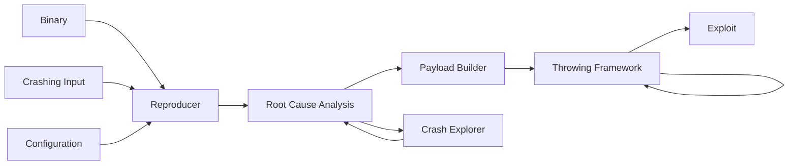

# autoexploit

## Description
This program, currently under construction, is designed to exploit binaries with buffer overflow vulnerabilities, ultimately providing shell access. It automates the exploitation process by analyzing the crashing behavior of vulnerable binary executable programs. The script systematically attacks these binaries with crafted inputs, observing how the program crashes and extracting valuable information from these crashes. This data is then used to develop a precise payload that manipulates vulnerable memory, enabling the execution of arbitrary code. By gaining control over the execution flow, the program successfully spawns a shell, demonstrating how vulnerabilities can be exploited for full system access.

## Build

To build with docker:

```sh
docker pull myrtopar/autoexploit:latest
docker build -t autoexploit .
```

## Demo Run

```sh
docker run --rm --privileged -v `pwd`/src:/app/src -it myrtopar/autoexploit:latest
python3 src/autoexploit.py {target_bin}
```

## System Diagram



<!-- 1. Variants of the original crash -->


## Contribute

## LICENSE

MIT license

## Demo

Produced in [asciinema](https://asciinema.org/).

autoexploit.py exploits the target binaries and spawns a /bin/sh


docker run --rm --privileged -v `pwd`/src:/app/src -it myrtopar/autoexploit:latest

python3 src/autoexploit.py {target_bin}

for tests: <br />
docker run --rm --privileged -v `pwd`/src:/app/src -v `pwd`/tests:/app/tests -e PYTHONPATH=/app/src -it myrtopar/autoexploit:latest <br />
python3 -m pytest tests/test_exploit.py::test_exploit <br />

for target binaries with extra arguments: <br />
python3 src/autoexploit.py {target_bin} {arg1} {arg1_pos} <br />


e.g <br />
ncompress -c {arg1}<br />
python3 src/autoexploit.py ncompress -c 1<br />

for some reason ncompress also works without arguments => forgot to add the extra arguments to the gdb prompt<br />


When the exploit is successful and the process spawns a shell, the shell closes only with Ctrl-D (EOF) due to the use of interactive(), and 'exit' doesn't work.
Target binaries go to: /mnt/binaries (included in $PATH)


